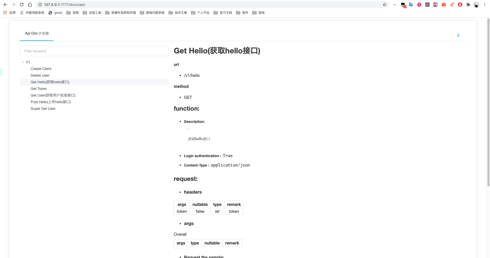

# FastAPI-Flask
## 快速的使用Flask进行Restful API开发

> 接触Flask也有一段时间了,从最开始用Flask写一些很简单的临时接口到后来写了些稍大的项目,对Flask的优点和缺点也有了些自己的理解
>Flask是一个快速 高效 稳定轻便的WEB框架,常被推荐给新手入门学习,几行代码就可以实现一个API接口,无需Django的复杂结构. 
>但这并不代表Flask就是完美的,当你想使用它做一个稍大的项目时你就会发现 ``没有约束其实就是最大的约束``,当所有问题都需要自己处理
>时就对开发者对框架和业务的理解带来了一定挑战.
>这个项目是我总结开发中最常用的一些功能搭建的一个模版,可以方便快速的开始进行开发工作,并对新手友好


### 这个模版有什么优势?

* 简化的wtforms校验流程,节省代码的同时为验证器封装了更多能力
* 简化的基于SqlAlchemy的增删改查
* 简洁易懂的目录结构和路由逻辑
* 内置数据软删除能力
* 基于角色的接口权限管理
* 搭建好的单元测试模版
* 灵活的登录/用户模块
* 完善的异常处理能力
* 简单高效的接口文档(支持半自动生成)
* 集成Pipenv作为项目包管理工具
* 自动序列化数据库对象能力

### 如何使用?

1. 将代码clone至本地
2. 确认当前Python环境 `>= Python3.7` (也可以自己修改Pipfile并重新生成lock文件以切换版本),并确认`pip`版本
3. cd进项目目录并执行 `pip install pipenv`
4. 执行 ``pipenv install``
5. 进入刚刚创建的虚拟环境,并执行 `pytest -v` 
6. 若单元测试执行成功则说明模版运行正常,否则请检查Python环境
7. 在项目根目录运行`python run.py`若成功则应看到以下输出:
```
 * Serving Flask app "app" (lazy loading)
 * Environment: production
   WARNING: This is a development server. Do not use it in a production deployment.
   Use a production WSGI server instead.
 * Debug mode: on
 * Running on http://127.0.0.1:7777/ (Press CTRL+C to quit)
 * Restarting with stat
 * Debugger is active!
 * Debugger PIN: 207-982-985
```
到这里就可以根据自己需求进行修改和开发了,或查阅文档: [还没开始写呢]()

### 如何使用内置的接口文档能力?

1. 首先依照以上步骤启动项目
2. 在本地浏览器访问以下链接[http://127.0.0.1:7777/docs/api/](http://127.0.0.1:7777/docs/api/)


